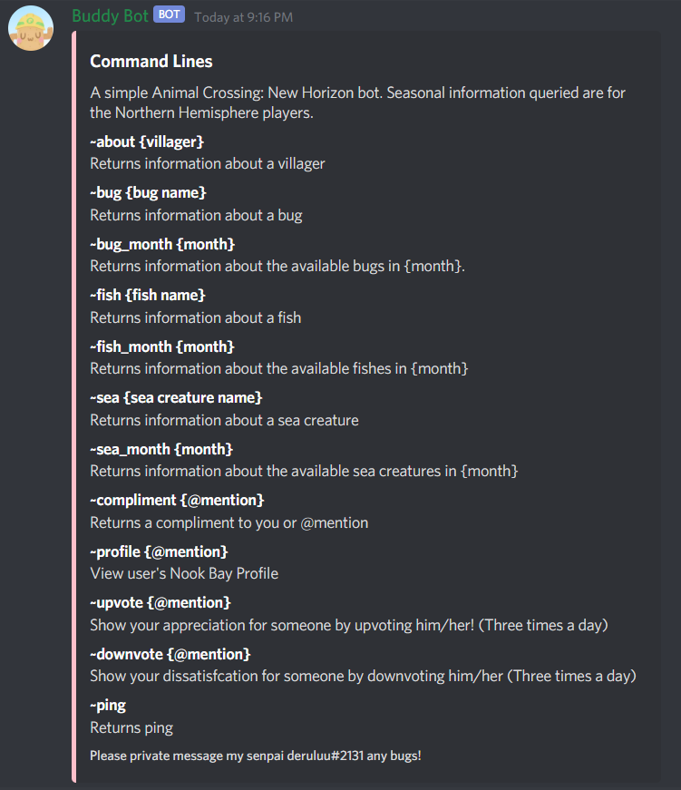
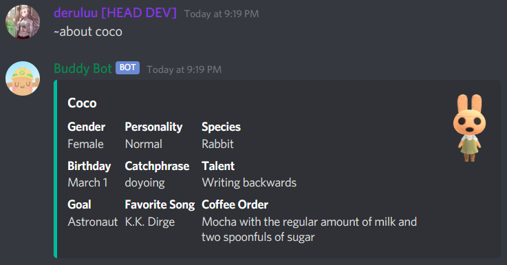

# Buddy Bot

**Introduction**

Buddy Bot, an Animal Crossing Discord Bot, displays information about villagers and critters. There are also other "for fun" commands, such as an uwu translator, displays random compliments, and an upvote/downvote system. I use Python's Beautiful Soup package to scrape data from the fandom page and use Python's pandas to export it into a .csv file. 

**Command List**

**Sample Queries**

___

___

